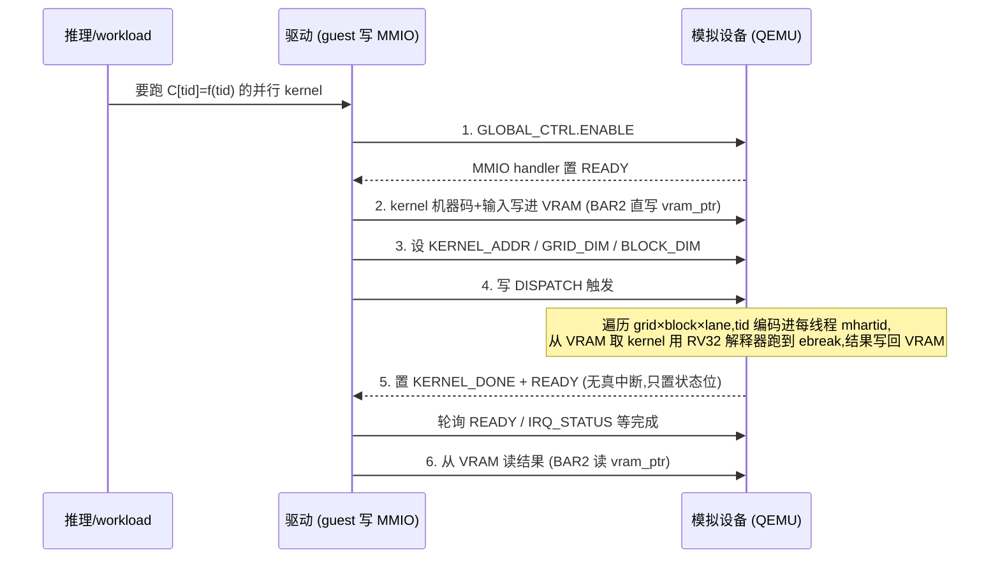
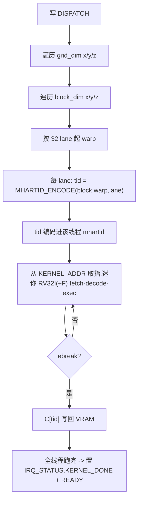

# QEMU GPGPU 方向

!!! note "主要贡献者"

    - 作者：[@Lfan-ke](https://github.com/Lfan-ke)

---

## 一、全视图：一个 kernel 从提交到出结果怎么走

核心闭环：驱动经 MMIO 提交 (数据 + 维度+dispatch)-> 设备按线程网格跑 kernel -> 结果落 VRAM -> 驱动读回。这就是真 GPU 的命令/寄存器提交模型的教学级缩影。

## 二、三层详解

推理/workload 侧：把要并行的计算写成一段 RV32 kernel(每线程按自己的 tid 算一格),放进 VRAM。测试里 kernel 是手写机器码字节数组 (csrrs mhartid 拿线程号 / andi / slli / lui / add / sw / ebreak)。

驱动侧 (guest 怎么驱动，即 MMIO 寄存器协议):
- 使能:GLOBAL_CTRL(0x0100)ENABLE b0;GLOBAL_STATUS(0x0104)READY b0 轮询。
- 送数据:BAR2 直接写 VRAM，或用 DMA_SRC/DST/SIZE(0x0400-0x0410)。
- 配 kernel:KERNEL_ADDR(~0x0300)、GRID_DIM x/y/z(0x0310/14/18)、BLOCK_DIM x/y/z(0x031C/20/24)。
- 触发：写 DISPATCH(0x0330)。
- 等完成：轮询 GLOBAL_STATUS(0x0104) 的 READY 位，或 IRQ_STATUS(0x0204) 的 KERNEL_DONE 位 (0x0200 是 IRQ_ENABLE 掩码、不是查询位;设备只置状态位、不拉真中断，故靠轮询)。
- 取结果:BAR2 读 VRAM。

模拟设备侧 (QEMU 怎么实现):
- BAR0 控制 (1MiB):gpgpu_ctrl_read/write 按上面 map 译码;DEV_ID(0x0000)=0x47505055("GPPU")、VERSION(0x0004)、VRAM_SIZE lo/hi(0x000C/0x0010)=64MiB;RESET(GLOBAL_CTRL b1) 自清且清 SIMT。
- BAR2 VRAM(64MiB):gpgpu_vram_read/write 直读写 s->vram_ptr，支持 1/2/4/8 字节。
- BAR4 doorbell(64KiB)。
- SIMT 上下文寄存器 (0x1000 组，可读写的 scratch:host 直接写入/读回，不参与 kernel 执行):thread_id x/y/z(0x1000/04/08)、block_id x/y/z(0x1010/14/18)、warp_id(0x1020)、lane_id(0x1024)。
- 同步寄存器组 (0x2000):thread_mask(0x2004);BARRIER(0x2000，写触发 block 屏障，当前 handler 未实现)。

## 三、DISPATCH 执行模型 (SIMT)

写 DISPATCH -> gpgpu_core.c 按 grid×block 遍历、按 32 lane 起 warp。每个 lane 的 tid 用 MHARTID_ENCODE(block|warp|lane) 编码进它的 mhartid,kernel 里 `csrrs mhartid` 就读到自己的线程号 -> 从 KERNEL_ADDR 处的 VRAM 取指 -> 迷你 RV32I(+RV32F) 解释器 fetch-decode-exec 到 ebreak 停 -> 把 C[tid] 写回 VRAM。注意执行不读写 BAR0 的 SIMT 寄存器 (那些只是 host 侧 scratch)。所有线程跑完，只置 IRQ_STATUS 的 KERNEL_DONE 位 + READY，不拉真 PCI/MSI 中断线，所以驱动只能轮询。

## 四、低精度指令 (测试 15-17)

在解释器里加自定义 fcvt:bf16 / e4m3 / e5m2 / e2m1 <-> f32 互转，round-to-nearest(实现用 roundf,ties-away-from-zero，不是严格 RNE)+ 饱和 (+Inf->max，如 E4M3 max 448、E2M1 max 6,0->0)。opcode 编码从 test kernel 的 hex 字节数组反推，只覆盖测试用到的子集。

各格式的位布局与取值。规格化数 (e≠0,k=尾数位宽):

$$ value = (-1)^{s} \cdot 2^{\,e-bias} \cdot \left(1 + \frac{m}{2^{k}}\right) $$

非规格化数 (e=0):

$$ value = (-1)^{s} \cdot 2^{\,1-bias} \cdot \frac{m}{2^{k}} $$

| 格式 | 位宽 | s / e / m | 指数 bias | 最大规格化值 |
| :--: | :--: | :--: | :--: | :--: |
| bf16 | 16 | 1 / 8 / 7 | 127 | ~3.39e38 |
| E4M3 (fp8) | 8 | 1 / 4 / 3 | 7 | 448 |
| E5M2 (fp8) | 8 | 1 / 5 / 2 | 15 | 57344 |
| E2M1 (fp4) | 4 | 1 / 2 / 1 | 1 | 6 |

饱和:f32 转窄格式时超过该格式 max 就钳到 max(f32 大数 / +Inf -> E4M3 的 448、E2M1 的 6),0 -> 0。舍入用 `roundf`(ties-away-from-zero),非严格 RNE，够过测试断言即可。

## 五、17 测试三层映射

- 1-12 纯寄存器/VRAM:device-id/vram-size/global-ctrl/dispatch-regs/vram-access/dma-regs/irq-regs/simt-*(thread/block/warp-lane/thread-mask)/simt-reset。补两个 handler 的地址译码即拿下。
- 13-14 kernel 执行:kernel-exec(RV32I,C[tid]=tid)、fp-kernel-exec(RV32F,out[i]=2i+1)。要迷你解释器。
- 15-17 低精度:lp-convert、lp-convert-e5m2-e2m1、lp-convert-saturate。要自定义 fcvt + 饱和。

## 六、QOS 测试怎么跑

不是独立 meson 测试名，是 qos-test 二进制里的节点：
`build/tests/qtest/qos-test -p /riscv64/.../gpgpu/gpgpu-tests/<子测试>`,或 `-l` 列全部再逐个 -p。

## 参考
- QEMU hw/misc/edu.c(教学 PCI 设备)= 寄存器+DMA+IRQ 模板。任务/讲义 gevico exercise + tutorial/2026。
