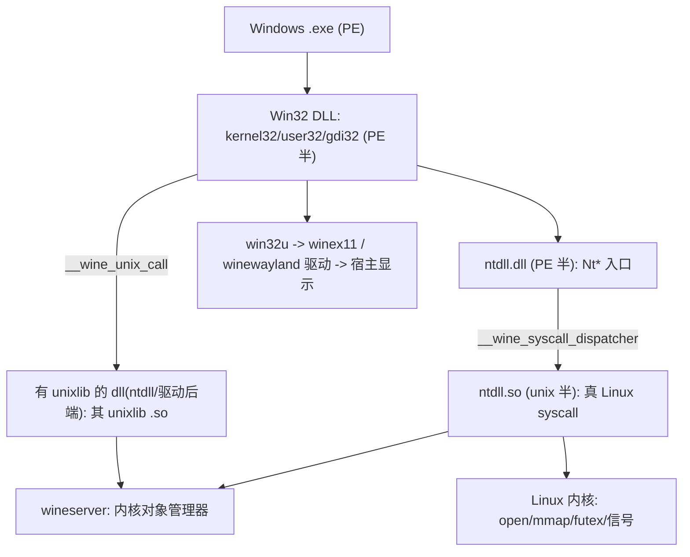
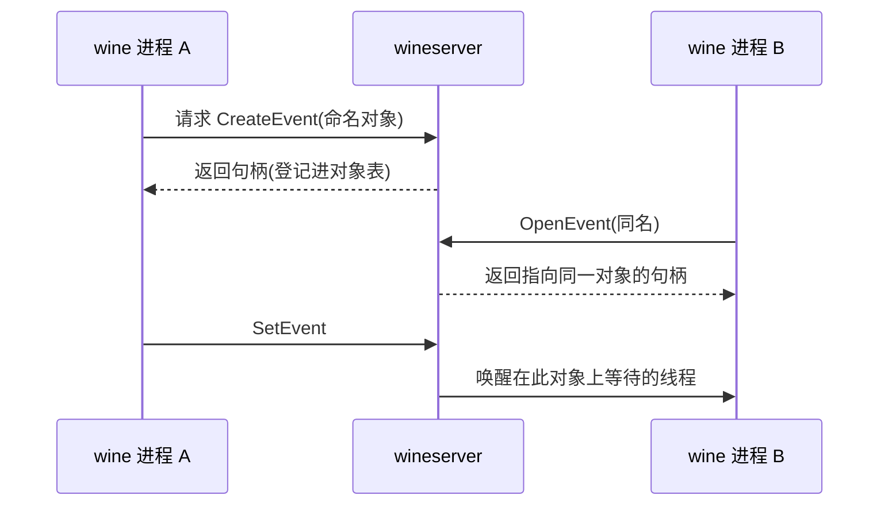
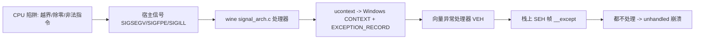

# QEMU Wine-CE 方向

!!! note "主要贡献者"

    - 作者：[@Lfan-ke](https://github.com/Lfan-ke)

---

src：[官网](https://www.winehq.org)，[官仓](https://gitlab.winehq.org/wine/wine)

先把 wine 本身从各个角度讲透：它是什么、怎么装 PE、怎么把 Windows 的 API 与内核对象语义翻到 Linux、进程线程与异常怎么落地、图形声音怎么出、家族里各分支差在哪，再到怎么熟练地用它。把 wine 吃透、用顺之后，最后一部分才接到跨架构 (x86 PE 跑在别的 CPU 上) 与 wine-ce 的原理。

## wine 是什么：兼容层，不是模拟器

wine 不是模拟器，是兼容层 (WINE = Wine Is Not an Emulator)。它不虚拟一台机器，而是干三件事：

- 重新实现 Windows 的用户态 API(kernel32 / user32 / gdi32 / ntdll ...),让程序以为自己在 Windows 上。
- 自带一个 PE 加载器，把 `.exe` / `.dll` 直接映射进宿主进程执行。
- 把 Windows 的系统调用与内核对象语义翻成宿主 OS(Linux) 的系统调用和机制。

所以在 x86 Linux 上跑 x86 Windows 程序，机器码不用翻译 (同是 x86),wine 只补 Windows 环境这层，开销极小，这就是"能不模拟就不模拟"。只有 CPU 架构不同 (x86 PE 跑在 riscv64) 时，才需要另一层指令翻译器 (box64 / qemu),而那不是 wine 的活。

## 全局架构

分层职责：

- PE 加载器：解析 PE 头，按段映射，处理导入 / 重定位 / TLS，跳 entry。
- ntdll:最底层，分 PE 半 (程序看到的 Nt* 入口) 与 unix 半 (真正落 Linux 的地方)。
- Win32 子系统 DLL:kernel32 / user32 / gdi32 / advapi32 ...,大多是 PE，最终经 ntdll 下到 unix 半。
- wineserver:每个 WINEPREFIX 一个独立进程，管所有 Windows 内核对象。
- WINEPREFIX:一个目录 = 虚拟 C 盘 + 注册表 + 盘符映射，一个独立 Windows 环境。

## PE 加载器与 PE 格式

Windows 的 `.exe` / `.dll` 是 PE(Portable Executable),Linux 的是 ELF。wine 要在 Linux 上跑 PE，先看懂 PE、按 PE 规矩装进内存、再把 PE 里对 Windows API 的调用接到 Linux 上。

PE 格式速览 (结构定义在 `include/winnt.h`):

- 开头是 DOS 头 `IMAGE_DOS_HEADER`,`e_magic='MZ'`;`e_lfanew`(偏移 `0x3c`) 指向真正的 PE 头。中间是 DOS stub(那句 "This program cannot be run in DOS mode")。
- `e_lfanew` 处是 `IMAGE_NT_HEADERS`:`Signature='PE\0\0'` + COFF `FileHeader`(`Machine` 如 `0x8664` AMD64 / `0xaa64` ARM64、段数、`Characteristics` 含 DLL 位)+ `OptionalHeader`(`ImageBase` 首选加载地址、`AddressOfEntryPoint` 入口 RVA、`Subsystem`、`DataDirectory[16]`)。
- 紧跟 section 表 `IMAGE_SECTION_HEADER[]`:`.text`(码 RX)/ `.data`(RW)/ `.rdata`(只读，导入导出表常在这)/ `.reloc`(重定位)/ `.tls` 等，每段有 `VirtualAddress`(内存 RVA)、文件偏移、内存属性位 (READ / WRITE / EXECUTE)。
- `DataDirectory[16]` 是总索引，按 RVA + 大小指向各表:EXPORT=0、IMPORT=1、BASERELOC=5、TLS=9、IAT=12 等。

PE vs ELF 关键差异：

| 维度 | PE(Windows) | ELF(Linux) |
| :--: | :--: | :--: |
| 定位表 | RVA + `DataDirectory` 索引 | program / section header + `PT_DYNAMIC` |
| 导入 | DLL 名 + 函数名 / 序号，每依赖一条 `IMAGE_IMPORT_DESCRIPTOR`(INT 名表 + IAT 地址表) | 全局符号表 |
| 序号导入 | 高位置 1 = 按序号导入 (可无名) | 无 (按符号名) |
| 重定位 | 按页 `IMAGE_BASE_RELOCATION`,fixup = (类型<<12) \| 页内偏移，类型 HIGHLOW / DIR64 | relocation entry 数组 |
| 段属性 | 写在 section `Characteristics` | 段权限 + 有 `interp` |

wine 在 Linux 上加载 PE，跨 unix 半 (引导 / 映射) 与 PE 半 (修正 / 起线程) 两处：

1. `wine-preloader`(unix) 先跑 (占 ELF 解释器的位),用 `PROT_NONE` mmap 占住 Windows 镜像要用的低地址范围，别让宿主 `ld.so` / mmap 抢了。
2. unix 半按 section `Characteristics` 逐段映射、设最终页保护 RX / RW / RO(`dlls/ntdll/unix/virtual.c` 的 `map_file_into_view` / `virtual_map_image`)。
3. 以下修正在 **PE 半** `dlls/ntdll/loader.c` 里跑 (它是 MinGW 编的 PE、作为 guest 码执行):
    - 重定位 `perform_relocations`:`delta = 实际加载地址 - OptionalHeader.ImageBase`,`delta` 非 0 才按 `.reloc` 修;EXE 已在 `ImageBase` 就跳过。
    - 导入 `fixup_imports` -> `import_dll`:对每个依赖 `load_dll`,按注册表 `DllOverrides` 决定用真实 native PE 还是 wine builtin，解析到的地址写进 IAT(IAT 常在只读段，写前先 `NtProtectVirtualMemory` 改可写)。
    - `LdrInitializeThunk` 收尾：跑各 DLL `DllMain(PROCESS_ATTACH)`、跳 entry(TEB / PEB 在此之前已由 unix 半分配，见进程 / 线程一节)。

关键点：自 Wine 5.0 起的 PE 化后，大多数 builtin dll(ntdll / kernel32 / user32 / gdi32 / CRT 等) 是 MinGW 编的**真 PE 文件**,装在 `lib/wine/<arch>-windows/`(带 32 字节 `Wine builtin DLL` 签名),加载器优先走 `open_builtin_pe_file` 打开真 PE。`map_so_dll`(依据 `.so` 内嵌 `IMAGE_NT_HEADERS` 在内存造 DOS / NT 头) 是**回退路径**,只用于仍以 `.so` 发布、导出 `__wine_spec_nt_header` 的模块 (如 ntdll.so 及少数 unix 侧 / 遗留库)。同架构下 builtin PE 本身就是宿主原生码、不用翻译;跨架构 (x86 PE 跑在 riscv64) 时这些 builtin PE 交给 box64 翻译执行 (见后)。

## ntdll 两半 + Nt 系统调用面

wine 里真正的 "Win32 到 Linux" 边界不在 kernel32，而在 **ntdll 的 Nt\* 系统调用面**(图形另有 win32u 的第二张表)。kernel32(经 kernelbase) 归到 ntdll 的 `Nt*` / `Zw*`,由 `__wine_syscall_dispatcher` 下到 `ntdll.so`(unix);user32 / gdi32 则归到 win32u 的 `NtUser*` / `NtGdi*`(win32u 自己的第二张 syscall 表，unix 实现在 `win32u.so`),syscall 同样由 ntdll 的 dispatcher 派发，但这些 Nt 函数与其 unix 实现属于 win32u、不在 ntdll。

- ntdll 分两半:PE 半 `ntdll.dll`(程序看到的原生 API 入口)+ unix 半 `ntdll.so`(真正落 Linux:信号、线程、内存、syscall 都在这)。
- 两半通过两个 dispatcher 相连，不是按名字链接：
  - `__wine_syscall_dispatcher`:走几百个 `Nt*` 系统调用 (一张系统调用号表),是 Win32 到内核语义的主干边界。
  - `__wine_unix_call_dispatcher`:有 unixlib 的那些 dll(ntdll，及各驱动 / 后端 dll:winex11.drv / winealsa.drv / winegstreamer 等),其 PE 半调自己 unix 半的一张函数表 (unixlib),用于非 Nt 的私有下调。(win32u 也有 unix 半，但它的下调走自己的 `NtUser*` / `NtGdi*` 第二张 syscall 表、由 `__wine_syscall_dispatcher` 派发，不走 unixlib。)
- 反方向 unix -> PE 的上调走 `KeUserModeCallback`(如 win32u 回调窗口过程)。

把 Nt 面当边界的好处：上面所有 Win32 DLL 都可以是纯 PE、可跨架构;真正碰 Linux 的代码集中在 unix 半这一薄层，移植一个新宿主架构主要就是补这薄层。

## PE↔unix 的 ABI 桥

- 只有需要直接访问宿主 (Unix) 资源的 builtin dll 才编两遍:PE 半 (MinGW 交叉编，程序看到的 Windows API 入口)+ unix 半 (`.so` unixlib,`-DWINE_UNIX_LIB`,真正落 Linux)。这类主要是 ntdll、win32u，以及各驱动 / 后端 dll(winex11.drv / winewayland.drv / winealsa.drv / winepulse.drv / winebus.sys / winegstreamer / bcrypt / secur32 等)。绝大多数 builtin dll(kernel32 / kernelbase / user32 / gdi32 / ole32 / msvcrt …) 是纯 PE、没有 unix 半，经 ntdll 的 `Nt*` syscall 与 win32u 的 `NtUser*` / `NtGdi*` syscall 间接到宿主。
- 为什么要 dispatcher 而不是直接 call:x86_64 上 Windows x64 ABI(整型参 RCX / RDX / R8 / R9,XMM6-15 被调用者保存) 和 Linux System V(整型参 RDI / RSI / RDX / RCX / R8 / R9) 不一样，dispatcher 要搬参数寄存器 + 保存 / 恢复 XMM6-15。
- riscv64 上没有 Windows PE 目标 (见跨架构一节),unix 半 dispatcher 是 riscv 原生码;Win64 与 Linux 之间的寄存器重排发生在指令翻译器 (box64) 那一侧，而非 wine 的 riscv dispatcher。

## wineserver:用户态的 Windows 内核对象管理器

Windows 的进程 / 线程 / 句柄 / 同步对象 / 注册表这些是内核对象，一处集中管理。wine 没有内核，就用一个独立进程 **wineserver** 顶替 NT 内核的对象管理器。

- 一个 WINEPREFIX 一个 wineserver，首个 wine 进程启动时按需拉起，session 内所有 wine 进程共用它。
- 管什么：进程 / 线程、句柄表、同步原语 (mutex / event / semaphore / 等待)、文件与 I/O 对象、命名对象空间、注册表、共享 section、窗口站 / 剪贴板等全局状态。
- 为什么独立进程：句柄要能跨进程继承 / 复制，内核对象是多进程共享的全局资源，得有一个中央权威;放在每个进程内无法共享。
- 通信:client(各 wine 进程) 经一条 unix domain socket 发定长请求 / 收回复 (协议在 `server/protocol.def`),大块或高频状态走一段 client 与 server 共享的内存 (如线程输入、时钟),避免每次都 round-trip。
- 等待与调度：内核对象的 `WaitForSingleObject` 等落到 wineserver 的等待队列 + 宿主 `futex` / `poll`。但**进程内**的临界区 (`CRITICAL_SECTION`) 不经 server:无竞争时是纯无锁原子 (`InterlockedCompareExchange` / `InterlockedIncrement`),有竞争才等、且默认走用户态单进程 Win32 futex(`RtlWaitOnAddress`)、仍不回 server;只有遗留的信号量回退 (持有真实句柄) 才 `NtWaitForSingleObject` 落到 server 信号量。

## 进程 / 线程 / TEB / PEB

- 每个 Windows 线程 = 一个宿主 pthread + 一块 TEB(Thread Environment Block);每个进程一块 PEB(Process Environment Block)。x86 上段寄存器 (fs/gs) 指向 TEB,`NtCurrentTeb()` 由此取。
- 进程创建：`NtCreateUserProcess` 经 wineserver 建对象、映射镜像、建初始线程;首线程 TEB 与 PEB 由 unix 半在进入 PE 侧前分配 (`virtual_alloc_first_teb` / `init_teb`),再跳 `LdrInitializeThunk` 完成 PE 侧初始化 (`loader_init`:填 PEB、跑各 DLL `DllMain(PROCESS_ATTACH)`、到 entry)。
- 线程创建：`NtCreateThreadEx` -> server 登记线程对象 -> unix 侧起 pthread，新线程先建自己的 TEB 再进 PE 入口。
- 句柄不是指针：是每进程句柄表里的索引，由 wineserver 维护，`DuplicateHandle` / 继承都经 server。

## 异常处理:Windows SEH 落到宿主信号

Windows 的结构化异常处理 (SEH,`__try` / `__except`、向量异常) 在 wine 里靠宿主 CPU 陷阱 + 信号实现，这正是 `signal_<arch>.c` 的活。

- CPU 出错 (访存越界 / 除零 / 非法指令)-> 宿主发信号 (SIGSEGV / SIGFPE / SIGILL)-> wine 的信号处理器接住。
- 处理器把宿主 `ucontext` 里的寄存器搬进 Windows 的 `CONTEXT` 结构、造一条 `EXCEPTION_RECORD`,再走 Windows 的分发链：先向量异常处理器 (VEH),再栈上的 SEH 帧 (`__C_specific_handler` 等),没人处理才 unhandled。
- 主动抛的 `RaiseException` 同样构造 record 走这条链;调试断点 / 单步也经此。
- 为什么 `signal_<arch>.c` 按架构分：它要逐寄存器读写宿主 `ucontext` 与 Windows `CONTEXT`(整型寄存器、PC / SP、FPU / 向量状态),布局随架构变。riscv64 宿主要新写这一份 (整型 `X[31]` = x1..x31 + `Pc` / `F[32]` / `Fcsr`,无独立 x0),对标最完整的 `signal_arm64.c`。

## WINEPREFIX:虚拟 C 盘、注册表、盘符映射

一个 WINEPREFIX 目录 = 一套独立的 Windows 环境 (默认 `~/.wine`):

- `drive_c/`:虚拟 C 盘，里面是 `windows/`(系统 DLL、`system32`)、`Program Files/` 等。
- `dosdevices/`:盘符到 Linux 路径的符号链接，`c:` -> `../drive_c`、`z:` -> `/`(整个宿主根),外设盘也在此挂;DOS 路径 `C:\foo` 就经这里翻成 unix 路径。
- 注册表：`system.reg`(HKLM)/ `user.reg`(HKCU)/ `userdef.reg`,是文本文件，wineserver 载入后对外提供 `RegOpenKey` / `RegQueryValue` 等;`DllOverrides`、已装软件、Windows 版本都记在这。
- 大小写:Windows 不分大小写，wine 在 unix 大小写敏感的文件系统上做匹配 (必要时扫目录找到大小写不同的同名项)。
- `WINEARCH=win32|win64` 定 prefix 位数，首次建 prefix 时决定，之后不可改。

## 图形 / 音频 / 输入子系统 与 Direct3D

Windows 里图形一半在内核 (`win32k.sys`),wine 把这半放进 unix 侧的 `win32u`:

- GDI / USER:`user32` / `gdi32`(PE 半) 画窗口、位图、文本，底下经 `win32u` 到显示驱动。
- 显示驱动：`winex11.drv`(X11)/ `winewayland.drv`(Wayland),把 Windows 的窗口 / 绘制映射到宿主窗口系统;无头环境可用虚拟显示。
- Direct3D 三条路：
  - **WineD3D**:D3D8 / 9 / 10 / 11 翻成 OpenGL,wine 自带、默认。
  - **DXVK**:D3D9 / 10 / 11 翻成 Vulkan，第三方，Proton 常用，性能好。
  - **vkd3d / vkd3d-proton**:Direct3D 12 翻成 Vulkan。
- 音频：`mmdevapi` / `winmm` 下到 `winealsa.drv` / `winepulse.drv`(Linux)/ `winecoreaudio`(mac)。
- 输入：`dinput` + `winebus`(HID),键鼠经显示驱动、手柄经 evdev / hidraw。

## builtin vs native DLL 与 DLL 生态

同一个 DLL,wine 里有两种来源：

- **builtin**:wine 自己的重写实现 (以伪装成 PE 的 `.so`,或 MinGW 编的真 PE 形式随 wine 发布)。
- **native**:用户放进 prefix 的真实 Windows DLL。

用哪个由 `WINEDLLOVERRIDES="dllname=n,b"` 或 winecfg 控制：`n`=native、`b`=builtin,`n,b` 表示先试 native 再退 builtin。核心 DLL(ntdll / kernel32 / user32 / gdi32 等) 必须 builtin，因为它们要接 wine 的 unix 侧;应用带的普通 DLL 则可 native。wine 重写的 DLL 有几百个，覆盖 kernel / user / gdi / 网络 (`ws2_32`)/ COM(`ole32` / `oleaut32`)/ 多媒体 / D3D 等。

## wine 家族:upstream / Proton / CrossOver / wine-ce

| 分支 | 谁做的 | 加了什么 | 场景 |
| :--: | :--: | :--: | :--: |
| Wine(upstream) | WineHQ 社区 | 本体:PE 加载 + Win32/NT 重实现 + wineserver | 通用 |
| Proton | Valve | 打包 DXVK / vkd3d-proton / FAudio / wine-mono + Steam 集成 | 游戏 |
| CrossOver | CodeWeavers | 商业支持 + 装机向导 | 商业 / 桌面 |
| wine-ce | 跨架构社区 | native-host + emulated-guest，异架构 PE 跑在别的 host | x86 PE 上 ARM / RISC-V / LoongArch |

它们同宗:Proton / CrossOver 基本是 upstream wine + 补丁 + 配套;wine-ce 的关键差别是把 "host arch == PE arch" 的假设拆开 (见下)。

## 一次 Win32 调用怎么走

程序 `call CreateFile` -> `kernel32.dll`(PE)-> `ntdll.dll` `NtCreateFile`(PE)-> `__wine_syscall_dispatcher` 跨到 `ntdll.so`(unix)-> 在 Linux 上 `open()` + 经 wineserver 登记句柄 -> 结果原路返回。图形 / 窗口类还会经 `win32u` 到 `winex11` / `winewayland` 驱动落到宿主显示。

## 用法：怎么用 wine

在标准 x86 Linux 上，装好 wine 后典型流程就是：建 prefix → 装应用 / 运行库 → 跑程序。

环境变量：

- `WINEPREFIX=/path/prefix`:指定虚拟 C 盘 (默认 `~/.wine`)。
- `WINEARCH=win64|win32`:prefix 位数，首次建 prefix 时定，之后不可改。
- `WINEDEBUG=-all`(关日志)/ `+relay`(每次 API 调用)/ `+seh`(异常)/ `+loaddll`(加载 dll):调试通道，逗号分隔。
- `WINEDLLOVERRIDES="dllname=n,b"`:控制某 DLL 用 native 还是 builtin。
- `WINELOADER` / `WINESERVER`:指定 loader / wineserver 二进制 (用非安装态构建树时要设)。

常用命令：

- `wineboot --init`:建 / 更新 prefix(生成注册表、系统 DLL、启动 services)。
- `winecfg`:图形配置 (DLL override、盘符、Windows 版本)。
- `wine program.exe [args]`:跑程序。
- `wine cmd /c "命令"`:跑内置命令 (冒烟常用 `cmd /c ver`、`hostname`)。
- `wine regedit` / `wine uninstaller` / `wine explorer`:自带工具。
- `wineserver -k`:杀掉当前 prefix 的 wineserver(prefix 卡住时)。

装应用与管理：

- 装软件：`wine installer.exe` 跑安装器;绿色软件直接 `wine app.exe`。
- **winetricks**:社区脚本，一键装常用运行库 / 字体 / 组件 (如 `winetricks vcrun2019 corefonts`),并设常见 DLL override。
- 多 prefix 隔离：不同软件用不同 `WINEPREFIX`,互不污染;换位数或坏了就删目录重建。
- 32 位应用：装进 `WINEARCH=win32` 的 prefix(或 win64 prefix 的 WoW64 路径)。

---

以上是 wine 本身:CPU 架构与 PE 相同 (x86 Linux 跑 x86 Windows 程序) 时，wine 只补 Windows 环境这一层、不翻译任何指令，装好就能直接用。以下才进入本方向的重点：当 CPU 架构不同 (x86 PE 要跑在 riscv64 等) 时怎么办，即跨架构与 wine-ce。

## 跨架构：异架构 PE 跑在别的 host

前面都假设 PE 的指令集 == 宿主 CPU。若不等 (x86-64 PE 跑在 riscv64),多一层指令翻译：

- PE 容器是 CPU 无关的：同一套 wine 加载器照样解析 DOS / NT 头、段、导入、重定位、TLS。但 `.text` 里是 x86-64 机器码，riscv64 CPU 不能执行，必须有指令翻译层。
- 分工:wine 提供 Windows 环境 (PE 加载 + Win32/NT DLL + PEB/TEB + wineserver + NT 系统调用面);**box64** 把 PE 里的 x86-64 指令 JIT 成 riscv64。别说 "wine 模拟 CPU",wine 不翻译指令，翻译全在 box64 / qemu。
- 加载能跨架构 != 代码能跑：加载器能把 x86-64 PE 映射到 riscv64，但每一条被执行的字节仍要 box64 翻译。aarch64 PE 同理 (换 ARM 模拟器)。

## wine-ce 原理:native-host + emulated-guest

wine-ce 的核心是把 "宿主架构 == PE 架构" 拆成两个变量：

- `current_machine`(host arch，如 riscv64)vs `emulated_machine`(guest PE arch，如 x86_64)。
- riscv64 定义 `UNSUPPORT_NATIVE_PE`,强制走 emulate-guest 路径:wine 没有 riscv64 的 PE 编译目标 (`--enable-archs` 不接受 riscv64),所以 Win32 DLL 不编成 riscv PE;riscv 构建走 `--enable-archs=x86_64,aarch64`。
- 于是 riscv64 上跑 x86 应用时：
  - **emulated-guest 侧**(x86-64 码，box64 跑):应用 EXE + 配套 x86_64 builtin DLL + PE 半 ntdll。
  - **native-host 侧**(riscv64 原生码):unix 半 `ntdll.so`、wineserver、信号 / 上下文处理。
- 边界:PE 半 (被模拟的 x86 码) 与 unix 半 (原生 riscv 码) 互调时，执行要在 "模拟 x86" 与 "原生 riscv" 之间切换。`__wine_syscall_dispatcher` / `__wine_unix_call` / `KeUserModeCallback` 这些转换点就是模拟器交出 / 收回控制的地方，box64 需正确处理跨界的栈与参数。
- 所以移植一个新宿主架构，主要工作在 native-host 这薄层：补该架构的 unix 侧信号 / 上下文 (`signal_<arch>.c`)、`CONTEXT` 布局、DWARF 寄存器图，让原生 riscv 码这半立得住;PE 那半仍是现成的 x86 / arm PE。

## 交叉构建到 riscv64(两阶段)

wine 交叉编要先有原生 wine tools(winebuild / wrc / widl),构建期要用它们生成代码：

1. 原生构建 tools:`./configure && make __tooldeps__`(得到 build-native)。
2. 交叉：`./configure --host=riscv64-linux-gnu --with-wine-tools=<build-native> --enable-archs=x86_64,aarch64 && make`（`--enable-archs` 指定要编的 guest PE 目标；riscv64 自身无 PE 目标，故列 x86_64 / aarch64，见 wine-ce 原理节）。

产物 `loader/wine` + `dlls/ntdll/ntdll.so` 是 RISC-V ELF。wine 只给有 unix 半的 dll(ntdll / win32u / 驱动) 编宿主 arch 的 unix `.so`,而每个 builtin dll 都编成目标 Windows PE(x86_64 / aarch64),所以 riscv64 构建里就有现成的真实 x86-64 PE(`kernel32.dll`、`cmd.exe` 等) 可拿来测。坑：`wrc` 找不到 `locale.nls` 时，在 build-native 里 `make nls/locale.nls`。

## box64 + wine 跑真实 x86 PE(端到端)

栈：`qemu-riscv64` -> `box64` -> x86_64 wine -> `cmd.exe`。关键 (不然撞墙):

- `env -i` 起干净环境，否则 wine 把 x86 ntdll 塞进 `LD_PRELOAD`,riscv64 `ld.so` 拒载报错。
- `BOX64_PREFER_EMULATED=1`,box64 直接模拟 x86 库，不去找不存在的 native riscv64 wrapper(如 liblzma)。
- `BOX64_LD_LIBRARY_PATH` 指到 x86_64 wine 的 dlls + `/lib/x86_64-linux-gnu`。

慢 (三层嵌套双重 JIT),但功能完整;真机 riscv64 无 qemu 层会快很多。

## 坑

- `signal_<arch>.c` 是宿主侧信号处理，不是 PE 目标 ABI;`--enable-archs` 不接受 riscv64(wine 没有 riscv64 的 PE 编译目标)。
- `WINEARCH` 建好 prefix 后改不了，要换位数删 prefix 重建。
- wineboot / 服务在三层嵌套下很慢，冒烟优先用不依赖复杂服务的 `cmd /c`。
- 卡死先 `wineserver -k` 清干净再重来。
- 核心 DLL(ntdll / kernel32 / user32 / gdi32) 不能用 native override，它们要接 wine 的 unix 侧。

## 参考

- wine 源码：`dlls/ntdll/unix/`(加载器 / 信号 / syscall)、`server/`(wineserver 与 `protocol.def`)、`dlls/win32u/`(图形内核侧);跨架构信号对标 `signal_arm64.c`。
- box64 wiki(x86 -> riscv64 / aarch64 动态翻译)。
- 任务与讲义:<https://qemu.gevico.online/exercise/2026/stage3/qemu-wine-ce/>、<https://qemu.gevico.online/tutorial/2026/ch3/qemu-wine-ce>。
