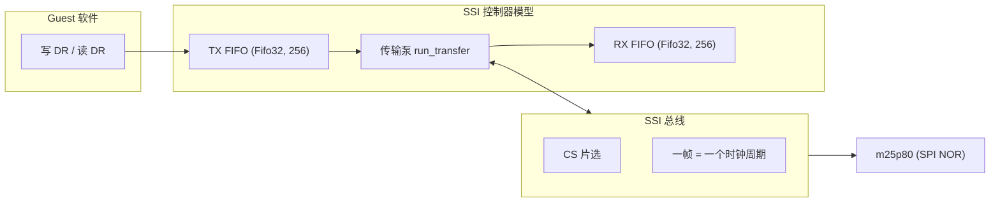
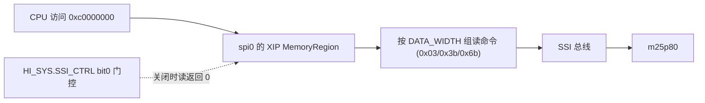

# QEMU 训练营 2026 项目阶段：从 IOMUX 到 K230 的 SPI/QSPI 建模

!!! note "主要贡献者"

```
- 作者：[@flamboyant](https://github.com/flamboyant)
```

> K230 外设建模项目阶段总结（2026 年 7 月 \~ 8 月）。从最简单的 IOMUX 寄存器块起步，走完上游提交流程，再到 DesignWare SSI 控制器的完整建模（标准 PIO / QSPI / IDMA / XIP），最终在 V2/V3 把模型拆成通用控制器 + K230 集成层。

项目从 IOMUX 起步——最简单的寄存器块，但把上游提交流程完整走了一遍（发补丁、被评审、拆补丁、补测试），"拆补丁"这个习惯后来一直用到 SPI。SPI/QSPI 这边，三个控制器恰好是同一个 DesignWare SSI IP，做一次覆盖三个实例；从标准 PIO 一路做到 QSPI + IDMA + XIP，最后 U-Boot 能从 Flash 读到 Linux 并启动起来。中间踩了不少坑，基本都是"没按软件的实际用法来"：要么是模式没实现全，要么是清除语义抄错了。

## 1. 项目介绍

### 1.1 项目开始前：K230 在 QEMU 主线长什么样

K230 是 Canaan（Kendryte）的 AIoT SoC，两个 RISC-V 计算核加一个新一代 KPU（Knowledge Process Unit）智能计算单元。项目开始前，QEMU 主线已经有 `-machine k230` 这台机器，`docs/system/riscv/k230.rst` 里写的 Supported devices 是这样：

```text
* 1 c908 cores (little core)
* Core Local Interruptor (CLINT)
* Platform-Level Interrupt Controller (PLIC)
* 2 K230 Watchdog Timer
* 5 UART
```

就这五项。机器的地址空间里，其余外设全部是 `create_unimplemented_device()` 占位——有地址窗口，但读写是黑洞。当时 `hw/riscv/k230.c` 里这样的占位有 53 个：从启动链上的 CMU、RMU、IOMUX、BootROM、DDRC，到存储的 SD、SPI、QSPI，到外设的 GPIO、I2C、PWM，再到电源的 PMU、PWR，一个不少。

启动方式上，机器支持 SDK U-Boot M-mode 启动和 direct Linux boot。有个当时 rst 就写明的坑：SDK Linux 内核用 T-HEAD C9xx 私有 MAEE 页表属性，QEMU 不实现 MAEE，这类内核得用标准 RISC-V PTE 重编才能跑。

一句话概括入场时的状态：**机器能启动，但基本没有外设可用**。

### 1.2 任务：一个母 issue，25 个子 issue

训练营在 `gevico/qemu-camp-2026-k230` 仓库里开了 K230 建模母 issue `#1`，下面拆成 25 个子 issue（`#2`\~`#26`），正好对着上面那一堆占位。任务本质很直白：**把这些占位逐个变成有真实行为的设备模型，让 SDK 的 U-Boot/Linux 驱动 probe 不卡死**。

子 issue 按功能分组大致是：

| 组   | 子 issue                                      | 当时状态         |
| --- | -------------------------------------------- | ------------ |
| 基础  | #2 CPU、#6 PLIC、#7 CLINT                      | 已有实现/复用，多为补强 |
| 启动链 | #3 DDRC、#5 BootROM、#10 CMU、#11 RMU、#12 IOMUX | 占位           |
| 存储  | #13 SD、#14 QSPI、#15 Flash window、#18 SPI     | 占位           |
| 外设  | #16 GPIO、#17 I2C、#19 Timer、#20 RTC           | 占位           |
| 电源  | #21 PMU、#22 PWR、#23 HI\_SYS                  | 占位           |
| 其他  | #24 Mailbox、#25 DMA、#26 GSDMA                | 占位           |

（全 25 个的含金量/难度/环境依赖评价在开发日志里。）当时 #8 UART、#11 RMU 已经有人认领，其余基本是开放的。

### 1.3 我的切入点

我选了这条线：先从 #12 IOMUX 入手——最简单的寄存器块，模型清晰，启动价值也够，适合做第一个认真的 PR；然后顺着启动链做 #18 SPI / #14 QSPI / #15 Flash window / #23 HI\_SYS。

选这条线的理由，第 3 章开头会详细讲，这里先给结论：**启动链有 gap**（镜像靠 host 搬进 RAM，Flash 启动是空的），而 SPI 是启动链绕不开的一环；加上三个 SPI 控制器恰好是同一个 DesignWare SSI IP，做一次能覆盖三个实例。

## 2. IOMUX：最简单的外设，最完整的流程

### 2.1 它是什么

IOMUX 负责"引脚配置"这一环：某个 pin 选哪个功能、要不要上拉、驱动能力多大。

??? note "为什么外设需要 IOMUX"

```
真实 SoC 上一个外设要工作，通常不只靠外设自己的寄存器：RMU 解除 reset、CMU 打开 clock、IOMUX 把相关引脚配成对应功能，最后才是外设控制器本身。IOMUX 是启动链和外设 probe 的前置配置之一。

K230 把它单独列成一种外设（多数 SoC 塞在 GPIO 里），64 个 pin 配置寄存器，每个对应一个物理管脚，reset 值按 TRM 一条条填。
```

实现是个很简单的 misc 设备（QEMU 里杂项设备都放 `hw/misc/`）：一段 32-bit 寄存器数组 + 读写 + 复位值 + 可写掩码。真实的电气特性很难在 QEMU 上实现，第一版只做寄存器兼容——把 `0x91105000..0x911057ff` 从 `create_unimplemented_device()` 变成可读写、可 reset 的寄存器 bank。

### 2.2 谁在用这块寄存器：U-Boot dts 的证据

一开始担心"这寄存器真有人用吗"，翻了 SDK U-Boot 的 dts，证据很硬。`k230.dtsi` 里声明了节点：

```dts
iomux: iomux@91105000 {
    compatible = "pinctrl-single";
    reg = <0x0 0x91105000 0x0 0x800>;
    #pinctrl-cells = <1>;
    pinctrl-single,register-width = <32>;
    pinctrl-single,function-mask = <0xffffffff>;
};
```

板级 `k230_evb.dtsi` 里直接按 `<offset, value>` 配引脚：

```dts
pins: iomux_pins {
    u-boot,dm-pre-reloc;
    pinctrl-single,pins = <
        /* BOOT */
        (IO0) (1<<SEL | 0<<SL | BANK_VOLTAGE_IO0_IO1 <<MSC | 1<<IE | 0<<OE | 1<<PU | 0<<PD | 2<<DS | 0<<ST)
        (IO1) (1<<SEL | 0<<SL | BANK_VOLTAGE_IO0_IO1 <<MSC | 1<<IE | 0<<OE | 1<<PU | 0<<PD | 2<<DS | 0<<ST)
        /* JTAG */
        (IO2) (1<<SEL | 0<<SL | BANK_VOLTAGE_IO2_IO13 <<MSC | 1<<IE | 0<<OE | 0<<PU | 1<<PD | 4<<DS | 1<<ST)
        ...
    >;
};
```

也就是说 U-Boot 的 `pinctrl-single` 驱动会做 32 位读改写，写完希望值能读回来——寄存器保存语义就够了，不需要 pin function 副作用。

### 2.3 实现前后的对比：从 unimplemented 日志到 U-Boot smoke test

实现前（unimplemented device），U-Boot 一跑，`-d unimp` 日志里刷一堆：

```text
unimp: unimplemented device write 0x91105000 (size 4)
unimp: unimplemented device write 0x91105004 (size 4)
...
```

??? note "unimplemented device 是什么"

```
`create_unimplemented_device()` 是 QEMU 给"还没建模的外设"占位用的：在地址空间里开一个窗口，读写一律打日志（读返回 0、写忽略），并标记为未实现访问。好处是 guest 访问不会崩、地址图完整；坏处是如果驱动**读回确认**或**依赖某些位**，行为就不对——而 U-Boot 的 pinctrl-single 驱动恰恰会读改写，所以这块日志正是"guest 真的在碰这块寄存器"的证据。
```

实现后，起一下 U-Boot 看到 `K230#` 就完事了：

```bash
qemu-system-riscv64 -machine k230 -bios u-boot.bin -nographic
```

到 `K230#` 后，抓的 log 里没有 iomux 的访问告警，说明 guest 访问到这边，建模生效了。配套的验证有 qtest、WDT 回归和 U-Boot smoke test（起机到 `K230#`）。

套路也简单：写之前先看 unimplemented 日志里 guest 碰哪些地址，写完再起一下 guest 确认没被打扰。

### 2.4 上游 review：拆补丁 + 位级掩码

RFC v1 发出去，Alistair 和 Chao 都给了反馈。第一次发 patch 就有人认真看，意见还很具体，照着改就行，挺难得的。

**Alistair Francis**：

1. 拆成三个补丁——设备模型、SoC 集成、qtest 覆盖，每个独立编译独立测试；
2. 别在 read/write 回调里手写 offset/size/alignment 检查，MemoryRegion 的 `.valid`/`.impl` 约束已经保证；
3. MMIO 窗口保留 0x800 字节，但只建模有文档的 64 个寄存器。

**Chao Liu**：寄存器不能把所有 32 位当普通可写存储——bit 31（`DI`，引脚输入状态）只读，bits 30-14 保留只读，只有 bits 13-0 可读写。v2 要按位权限做掩码：

```text
bit 31      DI        只读（引脚输入状态）
bits 30-14  reserved  只读
bits 13-0   配置字段   可读写
writable mask = 0x00003fff
```

v2 按这两条改完：三个补丁、删显式检查、只建 64 个寄存器、位级掩码、补只读/保留位测试。上游流程的完整闭环——RFC → 评审 → 修改 → 拆分 → qtest → v2——一个不落。

!!! note "这个环节沉淀了什么"

```
- "拆补丁"的习惯——后面 SPI 的补丁拆分就是从这条 feedback 长出来的；
- "每个寄存器的可写位单独确认，不一把梭"——后面 SPI 的 mask 表一直在用；
- 上游 review 不是走过场，意见具体到能直接照着改。
```

## 3. SPI：标准 PIO

### 3.0 为什么选这条线

选 SPI/QSPI 有两个原因，一主一次：

1. **启动链 gap**：当时看 K230 的启动方式，镜像基本靠 host 直接搬进 RAM，Flash 启动这条路是空的。而 SPI 恰恰是启动链上很重要的一环——K230 从 SPI NOR Flash 启动，U-Boot 得靠 SPI 把镜像读进内存。补上这个 gap，机器才能真正从 Flash 启动 Linux。
2. **IP 复用巧合**：原本 SPI 和 QSPI 是两个 issue，翻了 TRM 发现三个 SPI 控制器用的是同一个 Synopsys DesignWare SSI IP——做一次能覆盖三个实例，两个 issue 就合并成一个模型来做了。

三个实例能力不一样，但寄存器布局是同一套：

| 实例   | MMIO 地址      |           能力 | num-cs | 有 XIP |
| ---- | ------------ | -----------: | -----: | ----- |
| spi0 | `0x91584000` | SPI/QSPI/OPI |      1 | 是     |
| spi1 | `0x91582000` |        QSPI0 |      5 | 否     |
| spi2 | `0x91583000` |        QSPI1 |      5 | 否     |

!!! warning "SDK 编号与 SoC 子对象顺序对不上"

```
SDK 的逻辑编号（spi0/spi1/spi2）和 QEMU SoC 里的子对象顺序（`dw_ssi[0..2]`）是错位的：SDK 的 spi0 对应 `dw_ssi[2]`，spi1 对应 `dw_ssi[0]`，spi2 对应 `dw_ssi[1]`。这个映射写死在 `k230_ssi_routes[]` 里。
```

### 3.1 从 TRM 里读出来的模型骨架

目标很单纯：把寄存器空间映射到 MemoryRegion 上，能读能写，复位值对，mask 对。寄存器列表从 TRM 12.3 一条条抄：`CTRLR0`、`CTRLR1`、`SSIENR`、`SER`、`BAUDR`、`TXFTLR`/`RXFTLR`、`TXFLR`/`RXFLR`（动态）、`SR`（动态）、`IMR`/`ISR`/`RISR`、`*ICR`（读清除）、`DR0..DR35`。

!!! warning "一个容易被 TRM 忽略的细节：`VERSION` 寄存器"

```
`VERSION` 复位值 `0x3130332a`，按 ASCII 解出来是字符串 `1.03*`。TRM 自己写着 "Contains the hex representation of the Synopsys component version"——也就是说 **K230 TRM 自己承认这是 Synopsys 的 IP**，不是自研。这个发现后来成了"该不该拆通用模型"的关键证据（见第 6 章）。
```

??? note "Synopsys databook：有参考，但拿不到公开链接"

```
其实手上有 Synopsys 的 DWC SSI databook 和 DW APB SSI databook（eetop 上流传的 PDF），做语义核对时一直在用（TX-only、RXO 丢帧、RX-only dummy 重发这些精确语义就是从那对出来的）。但 Synopsys 官方只通过 myDesignWare 注册下发，**没有稳定的公开链接**——所以它只能作为内部一致性核对材料，不能作为上游 reviewer 可访问的引用。上游要证据时，最终还得靠公开的 K230 TRM + Linux 驱动 + Intel Arria 10 TRM（DW APB 家族对照）独立支撑。这也是 V3 时 Chao 要链接、我只能给公开资料三件套的原因。
```

PIO 数据通路是 `DR` 写入 → TX FIFO → 传输泵 → RX FIFO → `DR` 读出。QEMU 里 SPI 的建模方式是 SSI 总线：



??? note "QEMU 的 SSI 总线抽象"

```
QEMU 在 `include/hw/ssi.h` 里定义了 SSI（Synchronous Serial Interface）总线：

- `TYPE_SSI_BUS` 是总线，挂在 master 设备下；
- `TYPE_SSI_SLAVE` 是从设备接口，m25p80（SPI NOR Flash 模型）就继承它；
- master 用 `ssi_transfer(SSI_SLAVE(cs), value)` 给某个片选发一帧，slave 在自己的 `transfer` 回调里返回 RX 值。

一次 `ssi_transfer()` 就是一个时钟周期——master 推一个值出去，同时收一个值回来。**事务级抽象，不模拟波形**。这对 SPI NOR 这种只关心字节流的设备完全够用。
```

FIFO 用 `Fifo32`，容量 256。有个容易绕进去的点：`DR0` 到 `DR35` 这 36 个地址共享同一对 FIFO，读写入口得统一。

??? note "参考过的其他 SSI 模型"

```
写之前把 QEMU 里现成的 SPI/SSI 模型过了一遍，判断哪些值得借鉴：

| 模型 | 特点 | 借鉴/不借鉴 |
|---|---|---|
| `hw/ssi/sifive_spi.c` / `pl022.c` / `xilinx_spi.c` | 普通逐帧交换：pop TX → ssi_transfer → push RX | 看最朴素的 FIFO pump 长什么样 |
| `hw/ssi/ibex_spi_host.c` | 用 command length 保存剩余传输数量 | 结构参考 |
| `hw/ssi/xlnx-versal-ospi.c` | 读 Flash 时向 TX FIFO 填 0 产生读时钟 | 思路参考 |
| `hw/ssi/xilinx_spips.c` | 保存 command/address/dummy 的阶段状态 | 阶段机结构参考 |
| `hw/i2c/designware_i2c.c` | Synopsys DW I2C 通用模型，无 SoC wrapper | 后来 V2 拆分通用层的先例 |

这些模型不是 K230 寄存器语义的直接模板——普通控制器多数要求驱动自己写 N 个 dummy byte，而 DWC SSI 的 RO/EEPROM_READ 用 NDF 让硬件自动进数据阶段。所以借鉴的是**"阶段机 + FIFO pump"的结构**，而不是复制寄存器行为。当前 QEMU 树里没有可直接照抄的成熟 DWC APB SSI 外设模型，这也是 K230 的 `phase + remaining_frames` 看起来比普通 SPI 模型多一些状态的原因。

IDMA 那边还对照过两条路线：Versal OSPI 的 stream 模型（`stream_push`/`stream_can_push`，表达 backpressure）vs Aspeed SMC 的内部 AddressSpace 模型（控制器自己搬内存）。K230 走的是后者那种简化路线——因为 SDK 驱动死等 DONE，同步够用，异步是过度设计（详见 4.3）。
```

### 3.2 四种 TMOD 模式：怎么从 TRM + SDK 交叉确认

这是最值得讲清楚的部分。DW SSI 的 `CTRLR0[11:10]` 叫 TMOD，决定一次事务是"既发又收"还是单向的。TRM 定义了四种：

| TMOD | 名称           | 语义                     | 谁在用                     |
| ---- | ------------ | ---------------------- | ----------------------- |
| 0    | TR           | 全双工，TX 发多少 RX 回多少      | 裸机/通用驱动                 |
| 1    | TO           | 只发不收（写 Flash 用）        | U-Boot Page Program     |
| 2    | RO           | 只收不发，需一个 dummy word 启动 | 纯读                      |
| 3    | EEPROM\_READ | 先发指令 + 地址，再按 NDF 自动收     | **spi-mem Read-ID 就是它** |

怎么确认的？两条线索交叉：

1. **TRM 12.3**：寄存器字段定义 + 每种 TMOD 的时序描述；
2. **SDK 驱动**：U-Boot `designware_spi.c` 和 Linux `spi-dw-core.c` 里，`dw_spi_exec_op()` 对每种操作选什么 TMOD。

关键结论：四种模式走同一个 `k230_dw_ssi_run_transfer()` 传输泵，区别只在 RX 帧数怎么决定：

- TR/TO：TX FIFO 有多少发多少，RX 跟着回多少（TO 没有 RX）
- RO/EEPROM\_READ：由 `CTRLR1.NDF+1` 决定接收帧数，先发一个指令/地址帧，然后纯收

!!! bug "不实现 EEPROM\_READ，U-Boot 就卡死"

````
**现象**：挂上 Flash 跑 U-Boot，卡在 `spi_nor_read_id()`，`RXFLR` 永远为 0。

**机制**：一开始只实现了 TR 和 TO，觉得 RO 和 EEPROM_READ 后面再说。打开 trace 一看：

```text
CTRLR0 = 0x00000c07  -> TMOD[11:10] = 3，EEPROM_READ
CTRLR1 = 0x00000005  -> NDF + 1 = 6 个接收帧
SSIENR = 0x00000001  -> 控制器已启用
SER    = 0x00000001  -> CS0 已选择
RXFLR  = 0x00000000  -> 没有任何接收数据
```

根因是对软件怎么用控制器理解错了。普通全双工驱动是每个待收字节都写一个 dummy：

```text
写 opcode
写 address byte 0
写 address byte 1
写 address byte 2
写 dummy x3
读 RX FIFO
```

只要模型在每次 DR 写入时调一次 `ssi_transfer()`，就能自然得到 RX 数据。

但 K230 U-Boot 的 spi-mem Read-ID 是另一套序列：

```text
CTRLR0.TMOD = EEPROM_READ
CTRLR1.NDF  = 5
SSIENR      = 1
DR          = 0x9f        # 只写命令
SER         = 1
poll RXFLR               # 等 6 个字节回来
```

Guest 没有再写 6 个 dummy，因为真实硬件会在命令阶段后自动产生接收时钟。模型只在 DR 写入时发一次，最多发出 `0x9f`，之后没有任何 MMIO 写入触发剩余传输，`RXFLR` 永远为 0。

**不是 Flash 的问题**：问题不是 Flash 不返回 ID，是控制器根本没产生读 ID 所需的后续时钟。

**怎么从 SDK/TRM 找到答案的**：`spi_nor_read_id()` 卡住后，先去 TRM 12.3 查 TMOD 编码——`CTRLR0[11:10]=3` 就是 EEPROM_READ，TRM 明确写"命令阶段后自动产生接收时钟，接收帧数由 NDF+1 决定"。再去 SDK U-Boot 的 `designware_spi.c` 里翻 `dw_spi_exec_op()`，发现标准 read 路径压根不写 dummy、只写一个 `0x9f` 命令就 poll RXFLR。两条线索一对：TRM 说硬件会自己收，SDK 说软件只发命令——模型缺的正是"自动收"这半截。

**修法**：RO/EEPROM_READ 由 `CTRLR1.NDF+1` 决定接收帧数，先发指令/地址帧，然后自动收。

**教训**：实现顺序不能图省事，得跟着软件的实际调用路径走。
````

### 3.3 挂 Flash：num-cs 的 SDK 内部冲突

挂 Flash 是 `spi-flash` 机器属性，m25p80 挂 CS0。这里踩了个 SDK 内部对不上的坑：

!!! warning "num-cs 在 SDK 内部就对不上"

```
U-Boot DTS 里 `num-cs` 是 **`1/5/5`**（spi0/spi1/spi2），Linux DTS 里是 **`1/1/1`**。不是功能 bug，更像是两边 DTS 没对齐（Linux 侧可能用了驱动默认值而非 SoC 实际值）。

处理方式：按当前启动软件路径选了 `1/5/5`，但没写成 TRM 唯一结论，上游说明里保留了证据差异。

**教训**：遇到 SDK 内部不一致，记录证据、按用例决策、不替上游下结论。
```

### 3.4 IRQ：动态水位，不是缓存值

9 路 IRQ 接进 PLIC（TXE、RXF、RXO、TXU、RXU、MST、DONE、AXIE 加总清，IRQ base 三实例连续）。TXE/RXF 一开始是缓存的，后来改成动态水位——从 FIFO 实际数量算，不缓存：

```c
static uint32_t k230_dw_ssi_irq_raw_status(K230DwSsiState *s)
{
    uint32_t status = s->irq_latched;
    uint32_t tx_used = fifo32_num_used(&s->tx_fifo);
    uint32_t rx_used = fifo32_num_used(&s->rx_fifo);
    uint32_t tx_threshold = FIELD_EX32(s->regs[R_TXFTLR], TXFTLR, TFT);
    uint32_t rx_threshold = FIELD_EX32(s->regs[R_RXFTLR], RXFTLR, RFT);

    if (tx_used <= tx_threshold) {
        status |= R_RISR_TXEIR_MASK;
    }
    if (rx_used > rx_threshold) {
        status |= R_RISR_RXFIR_MASK;
    }
    return status & K230_DW_SSI_IRQ_VALID_MASK;
}
```

!!! note "为什么不能缓存"

```
TXFLR/RXFLR 是 MMIO 动态视图，不能从 `regs[]` 读缓存值代替；TXFTLR/RXFTLR 也必须只取 TFT/RFT 字段。FIFO 满时写入要锁存 TXO 并更新 IRQ。
```

### 3.5 验证：U-Boot + Linux 两侧都跑一遍

标准 PIO 的验证就是 U-Boot 和 Linux 两侧都跑一遍读写。U-Boot 侧 `sf probe` / `sf read` 把镜像读进内存，bootm 启动 Linux：

```text
sf probe 0:0
sf read 0x0c100000 0x0 0x14000        # OpenSBI
sf read 0x08200000 0x100000 0x1a1fe00 # Linux
sf read 0x0a100000 0x1c00000 0x1eec20 # initrd
sf read 0x0a000000 0x1f00000 0x1000   # DTB
bootm 0x0c100000 - 0x0a000000
```

Linux 侧就是 `dw_spi_mmio` probe → `spi-nor`（w25q256）→ MTD 分区 erase + pwrite + pread + 校验。这条 `-bios` 读 Flash 的链在 V1/V2/V3 每轮升级后都是必跑的验收，dts 该改的改了（bus-width 8→1、spi0 显式 okay 之类），输出基本一样。

## 4. QSPI + IDMA：测着测着就绑定到一起了

### 4.1 为什么两个是一体的

QSPI 和 IDMA 原本是分开想的，做 QSPI 的时候才发现它俩绑在一起：**SDK 在总线宽度大于 1 时，走的是控制器内部 IDMA，而不是普通 PIO dummy**（`SPI_FRF != Standard` 时传输泵会停，数据搬运交给 IDMA）。所以 QSPI 的验证绕不开 IDMA，两个就一起做了。

### 4.2 QSPI 四阶段事务

普通 enhanced 模式把一次事务拆成四阶段：指令 → 地址 → dummy → 数据。`SPI_CTRLR0` 的关键字段：

| 字段           | 含义                             |
| ------------ | ------------------------------ |
| `INST_L`     | 指令长度（0=不传，1=8 位，2=16 位，3=32 位） |
| `ADDR_L`     | 地址长度                           |
| `DATA_WIDTH` | 数据宽度（1/2/4/8 位）                |
| `WAIT`       | dummy cycles 数                 |

!!! bug "dummy cycles 的字节宽 vs 线宽（上游 m25p80 更新暴露的）"

````
**现象**：rebase 到新 QEMU 基线后 qtest 红掉——`/qspi/dual-quad-output-read` 报 `actual != expected`。rebase 无冲突、构建也成功，纯粹是测试过不了。

**机制**：这是 K230 SSI 和上游 `m25p80` 对 dummy phase 的"旧契约"不再一致。背景是：QEMU 主线**最近刚更新过 m25p80 的 dummy-byte 换算**（Winbond 等 flash 的 `0x3b`/`0x6b`，8 个 dummy clocks 只应发 1 个 SSI dummy byte），而上游从设备模型更新了，我的主设备模型还按旧契约发——K230 qtest 对 `0x3b`/`0x6b` 用 `SPI_CTRLR0.WAIT_CYCLES=8`，这个字段的单位是 dummy clock cycles，旧实现直接把它当成 `ssi_transfer()` 的次数，发了 8 个 SSI 字节。

多余的 7 个零字节会在 flash 已进入数据阶段后消耗真实数据，控制器读到的就是偏移后的内容——**m25p80 变对了，我的模型还按旧契约发**。

**修法**：换算必须依据 dummy phase 宽度：`TRANS_TYPE=0`（1-1-2/4 output read）走单线 dummy phase；`TRANS_TYPE=1/2` 按 Dual/Quad 的 2/4 线宽计算，发送次数是 `ceil(WAIT_CYCLES * lines / 8)`。Quad I/O 的 mode byte 仍是独立字段，不能重复计入 dummy bytes：

```c
static uint32_t k230_dw_ssi_dummy_bytes(uint32_t spi_frf,
                                         uint32_t trans_type,
                                         uint32_t wait_cycles)
{
    uint32_t lines = 1;

    if (trans_type != 0) {
        lines = spi_frf == 1 ? 2 : 4;
    }

    return DIV_ROUND_UP(wait_cycles * lines, 8);
}
```

**教训**：跟上游基线保持同步。上游修了从设备模型，我的主设备还按旧契约发，rebase 一重放就暴露。这也是为什么每次 rebase 都要跑全量 qtest，光看构建过远远不够。
````

### 4.3 IDMA：同步还是异步

IDMA 是控制器自己带的 AXI master，不是外接 DMA。一开始想做成异步的（QEMU 里有现成的 stream 模型：master/slave 用 `stream_push()`/`stream_can_push()` 互动，能表达 backpressure 和分块搬运），但翻 SDK 驱动发现：

??? note "SDK 驱动的 IDMA 用法"

````
U-Boot 的 `designware_spi.c` 和 RT-Smart 的 `drv_spi.c` 都是**轮询 `DONE` 位**的：

```c
/* 伪代码：SDK 驱动的 IDMA 使用方式，摘自 RT-Smart drv_spi.c */
spi->dmacr = DMACR_IDMAE | DMACR_AINC | ...;
spi->spi_ar = flash_offset;
spi->axi_ar0 = dram_addr;
spi->axi_awlen = length;
spi->ser = 1 << cs;
spi->ssienr = 1;
/* 然后……就死等 DONE */
rt_event_recv(..., BIT(SSI_DONE) | BIT(SSI_AXIE), ...);
spi->ser = 0;
spi->ssienr = 0;
```
````

软件既然死等，QEMU 同步模型就够：写完 `SSIENR=1`，一次性把数据从 Flash 搬到内存，置 `DONE`。异步反而多个 BH、多套 backpressure，软件根本感知不到。

QEMU 里 DMA 本质是"设备代替 CPU 访问 Guest 内存"，直接 `memcpy` 不行（Guest 物理地址 ≠ Host 虚拟地址，中间隔着 MemoryRegion 翻译），得用 `dma_memory_read()`/`dma_memory_write()` 走 AddressSpace。

!!! note "什么时候该用 BH 异步"

```
Bottom Half（`aio_bh_schedule`）用于模拟"真实硬件上后台跑、软件一边干别的"的 DMA。这里软件就是死等 `DONE`，vCPU 反正要停，同步反而更贴合软件行为。同步够用，异步是过度设计。
```

IDMA 也收过一次语义：

- **IDMA 使能时 DR 读写要拒绝**（PIO 和 IDMA 互斥，不能一边跑 DMA 一边写 FIFO）；
- **fixed-address IDMA 不支持**（`AINC=0` 只 LOG\_UNIMP 然后结束事务，不假装搬了）；
- **触发要求 FIFO 为空**。

!!! bug "DONECR 的 read-clear 语义（Linux Quad 组合验证才暴露）"

```
**现象**：Linux 5.10.4 Quad 的 MTD write/read/cmp 测试失败。

**机制**：SDK Linux 驱动的 DONE IRQ handler 是**读 `DONECR` 清除中断**（TRM 的 RC 属性：读取返回并清除 DONE 锁存），最初却实现成"读恒为 0、写才清"。后果是 U-Boot 阶段遗留的 DONE latch 在 Linux 打开 DONE IRQ 后变成**陈旧中断**——新事务还没启动，驱动就以为上一个完成了。

**怎么从 SDK/TRM 找到答案的**：先在 SDK Linux 驱动里找到 DONE 中断的处理函数，看到 IRQ handler 里读了一次 `DONECR`——为什么读一下就能清？回 TRM 12.3 查 `DONECR` 的访问属性，表格里写着 `RC`（read-clear）：读取返回锁存状态并清除事件，写入忽略。两条一对就明白了：TRM 定义了 RC 属性，驱动按 RC 用，模型却按"写清除"实现——读路径压根没清，锁存一直挂着。

**修法**：改成 `DONECR` read-clear（`AXIECR` 同理）。修完后 Linux 5.10.4 Quad 的 256 B 和 4 KiB MTD 测试全过。

**教训**：中断清除语义要对着 SDK 驱动的实际用法抄，不能想当然——TRM 写的是 RC（read-clear），驱动读一下你就得真的清。
```

## 5. XIP：把 Flash 当内存读

最后加的是 XIP 模块。`HI_SYS` 是 SoC 级包装寄存器（`0x91585068` 的 `SSI_CTRL`），控制 XIP 使能和三实例模式/休眠。XIP 是给 spi0 挂一个 128 MiB 的 MMIO 窗口 @ `0xc0000000`，CPU 直接当内存读 Flash。



!!! warning "XIP 窗口的两个 QEMU 坑"

```
1. **超大访问**：窗口默认被 QEMU 当普通 RAM，guest 一次 `memcpy` 可能发超大访问，但 SPI NOR 只能按事务读。所以 XIP ops 的 `.impl.max_access_size` 设成 4 字节，让 QEMU 自动拆成多次 word 读。
2. **4-byte address mode**：W25Q256 在 `sf probe` 后会进 4-byte address mode，XIP 寄存器必须在所有 `sf read` 完成后重新配置，opcode 用 `0x13`（4-byte Read）。用 3-byte read 配置，XIP 读取会错位。实机调试才发现的。
```

验证输出，U-Boot 直接从映射窗口读 uImage 头：

```text
c0000000: 56190527
## Booting kernel from Legacy Image at c0000000 ...
Verifying Checksum ... OK
Starting kernel ...

OpenSBI v0.9
[    0.000000] Linux version 6.18.28
meta-k230 initramfs starting...
~ #
```

`56190527` 是 OpenSBI uImage 的 magic，能读到并且 checksum OK，说明 XIP 窗口真的把 Flash 里的 OpenSBI 映射出来了。

## 6. 上游 review：该拆了

V1 后期，Bin Meng 在 patch 1 上给了一个反馈：**把模型拆成两层**——一个通用的 Synopsys DesignWare SSI 控制器模型，加一个可选的 K230 专有 wrapper。目的是让这个模型以后能被其他用 DW SSI IP 的 SoC 复用。

我当时的第一反应是"凭什么是通用的"，结果一翻 TRM 和驱动，证据全摆在那：

1. TRM 自己承认是 Synopsys IP：`VERSION` 寄存器那段原文，加全文大量 `SSIC_HAS_*` 这种 Synopsys 参数化配置项；
2. U-Boot 的 `designware_spi.c` 就是通用 driver：Denx 维护，基于 Linux `drivers/spi/spi-dw.c`，K230 SDK 只在顶部改了一行；
3. QEMU 已有先例：`hw/i2c/designware_i2c.c` 就是 DW I2C 的通用模型，通用层加属性就够了。

结论很清楚：该拆。但 V1 收尾时我没拆——重点是收敛启动路径，让 U-Boot 真的能从 SPI NOR 起来。拆分是个大重构，得重新设计模型组织、把寄存器按通用/K230 专有分类。这些事放到 V2 做，V1 先把功能跑通、把能 review 的东西稳住。

## 7. V2/V3：拆成通用模型

### 7.1 拆分

V1 发完动手拆。关键架构变化：

- 通用模型 `TYPE_DW_SSI`（后来 V3 改名 `TYPE_DWC_SSI`）不再引用任何 K230 概念，实例差异全部走 `DwSsiConfig` 属性（num-cs、fifo-depth、imr-reset），想复用就传参数；
- HI\_SYS 反向指针摘掉了，XIP 使能从"SSI 反向持有 K230 指针"变成 GPIO `xip-enable` input——通用层对 K230 一无所知，干净；
- **第一批只发 Standard PIO，enhanced、IDMA、XIP 推迟为独立 follow-up series**。

!!! note "为什么 V2 只裁剪到 Standard PIO"

```
不是做不了，是**故意裁的**。V2 是架构大改：文件重命名、类型改名、属性化、HI_SYS 解耦，本质是一次重构。如果一次性把 enhanced/IDMA/XIP 全搬过来，patch 数量、代码量、review 压力都会爆炸——V1 那 11 个补丁 1700+ 行已经让 reviewer 很吃力了。所以第一批只保 Standard PIO 闭环：模型更小、review 更快、架构变化更容易被接受。等架构站稳了，enhanced/IDMA/XIP 再以独立 series 慢慢加回来——**功能可以分步推进，架构一次别动太大**。这也是从上游"每个补丁只做一件事"里长出来的思路。
```

拆完的 5-patch 系列（08-02 发送）：

| # | 标题                                                          | 职责                                 |
| - | ----------------------------------------------------------- | ---------------------------------- |
| 1 | hw/ssi: Add Synopsys DesignWare SSI standard PIO controller | 通用 DW SSI 本体：寄存器、FIFO、四种 TMOD，属性驱动 |
| 2 | hw/ssi: Add DesignWare SSI standard interrupt support       | 9 路 IRQ 输出                         |
| 3 | hw/riscv/k230: Instantiate DesignWare SSI controllers       | K230 三个实例落地                        |
| 4 | hw/riscv/k230: Route SSI interrupts to the PLIC             | 接到 PLIC                            |
| 5 | hw/riscv/k230: Attach a standard SPI NOR flash              | spi0 CS0 挂 m25p80                  |

### 7.2 V3：reviewer 让改名

V2 发出去，反馈全集中在 patch 1，两条：

1. **Chao Liu**：DesignWare SSI 的 databook 是 Synopsys 私有的（要注册 myDesignWare 才能下），没有公开链接。总不能一句"没有"就完事——把实现依据的公开资料整理成三类：K230 TRM（寄存器直接依据）、Intel Arria 10 HPS TRM 第 20 章（DW APB 家族对照）、Linux `spi-dw-core.c`/`spi-dw.h`/`snps,dw-apb-ssi.yaml`（软件怎么访问的对照）。
2. **Anirudh（Tenstorrent）**：`dw-apb-ssi` 和 `dwc-ssi` 这俩变体，CTRLR0 的 TMOD 位位置根本不一样——APB 在 bit 8/9，DWC 在 bit 10/11。查证属实（TMOD、DFS、FRF、SCPH/SCPOL 布局全不一样）。

### 7.3 发 V2 后自审出的四个 PIO 语义 bug

除了接招，发完 V2 又回头把 PIO 路径从头审了一遍，审出四个隐藏 bug，全是 Standard-only 范围内的：

| Bug                        | 问题                                                           | 修法                                                                |
| -------------------------- | ------------------------------------------------------------ | ----------------------------------------------------------------- |
| EEPROM-read 进数据阶段太早        | 每次 DR 写入就立即跑 transfer，第一字节 opcode 可能直接触发 data phase，后面地址没机会发 | 修 command/data 分界，qtest 用"多字节 command + 非零地址 + NDF"的真实 flash 用例兜住 |
| TX-only 长传输要等 guest 读状态才继续 | 64 帧批次的坑——V1 的 pace 修复把推进绑定在 TXFLR/SR 读取上，中断驱动 guest 可能永久等待  | 让 TX FIFO 连续发完，qtest 用 TXFTHR=255 + 256 帧验证从设备全收到                 |
| RX FIFO 满了居然让传输暂停          | 实现成 backpressure，等 guest 读走——databook 规定是置 RXO、丢新 frame、传输继续 | TR/RO/EEPROM-read 全改成"丢帧继续"                                       |
| RX-only 把启动 dummy 丢了       | 发完第一个 word 后面固定发 0x00，databook 要求整个传输期间重发同一个 word            | 重发同一 word，qtest 用非零 dummy（0xa5）在 loopback 下验证                     |

!!! note "这些 bug 是怎么被翻出来的"

```
四个全是发 V2 后自审发现的——当时用"黑盒合同"重新过了一遍 PIO 状态机，发现 qtest 只覆盖了"软件实际走到的路径"，没覆盖"TRM 定义的合同"。要是 V2 发之前就把边界测全，能省一轮 review。
```

还有几个"边界怎么划"的决定：

- 九路 IRQ 拓扑保留（TRM 和软件集成证据都支持），但 Standard-only 下 DONE/AXIE 恒低、clear 寄存器 RAZ/WI；
- `SPI_FRF` 没单独放开 writable mask——放开了 guest 会以为有 enhanced 能力，可数据路径压根没有，所以继续固定 Standard 并补"写 Dual/Quad 读回 Standard"的测试；
- 不为测试单独造通用 machine，直接拿 K230 machine 当测试床。

V3 五个 commit 重写完成，qtest 收敛成 14 项，构建、checkpatch、`git diff --check`、残留搜索、参考链接全过。

## 8. 这次项目沉淀了什么

回头看，这几个月沉淀下来的东西其实就几条，都是踩坑踩出来的：

- **先看 guest 碰什么，再决定模型做什么**。写之前跑 unimplemented 日志，写完起 guest 确认没被打扰——IOMUX 和每个后续外设都是这么收尾的。
- **TRM 给定义，SDK 给用法**。寄存器字段、时序、模式定义看 TRM；"哪个 TMOD 在什么场景用""中断怎么清""DMA 怎么触发"看 SDK 驱动。EEPROM\_READ 卡死和 DONECR 陈旧中断，都是这两条线索一对才定位的。两者对不上时，记录证据、按用例决策、不替上游下结论。
- **建模取舍看软件怎么用**。软件死等 `DONE` 就同步（同步够用，异步是过度设计）；没人消费的副作用不做（IOMUX 的 pin function、XIP 的线级时序），先划边界；每次 rebase 跑全量 qtest，光看构建过远远不够。
- **上游交互**：认真参考 reviewer 的建议、先查证再改，保证每次修改回归验证完整，不影响先前的基线。
- **多参考 QEMU 主线现有代码**：学习优秀实现和架构，争取复用（designware\_i2c 拆分先例、sifive/versal 等 SSI 模型的阶段机结构都是这么来的）。

反思：第一版把所有东西塞进 `k230_dw_ssi.c`（1754 行）是为了快速跑通，代价是 V2 要重构。如果重来一次，会在一开始就分层——先把通用寄存器壳搭好，再在 K230 wrapper 里填实例化参数。不过话说回来，没有 V1 的"一锅炖"，可能也搞不清哪些是通用的、哪些是 K230 专有的——正是 V1 的混乱催生了 V2 的拆分需求。

## 9. 后续

这个项目还没完。V2 第一批只发了 Standard PIO，是故意裁小的；后续的 enhanced（QSPI）、IDMA、XIP 会以独立的 follow-up series 继续贡献——等前面的贡献在上游稳定下来，再一个系列一个系列地推。功能分步推进，架构一次别动太大，这是从这一路学到的节奏。

## 参考资料

\[1] Kendryte. K230 Technical Reference Manual V0.3.1 (2024-11-18). <https://github.com/revyos/external-docs/blob/master/K230/en-us/K230_Technical_Reference_Manual_V0.3.1_20241118.pdf>

\[2] K230 SDK（U-Boot / Linux / RT-Smart 源码）. <https://github.com/kendryte/k230_sdk>

\[3] Intel. Arria 10 HPS Technical Reference Manual（DW APB SSI 家族对照）. <https://www.intel.com/content/www/us/en/docs/programmable/683711/21-2/hard-processor-system-technical-reference.html>

\[4] Linux DW SPI core. <https://github.com/torvalds/linux/blob/f9a2394a23482bfd330911e9c8295b71724feacd/drivers/spi/spi-dw-core.c>

\[5] QEMU DesignWare I2C 通用模型先例（hw/i2c/designware\_i2c.c）. <https://github.com/qemu/qemu>

\[6] QEMU Camp 训练营仓库。<https://github.com/gevico/qemu-camp-tutorial>
