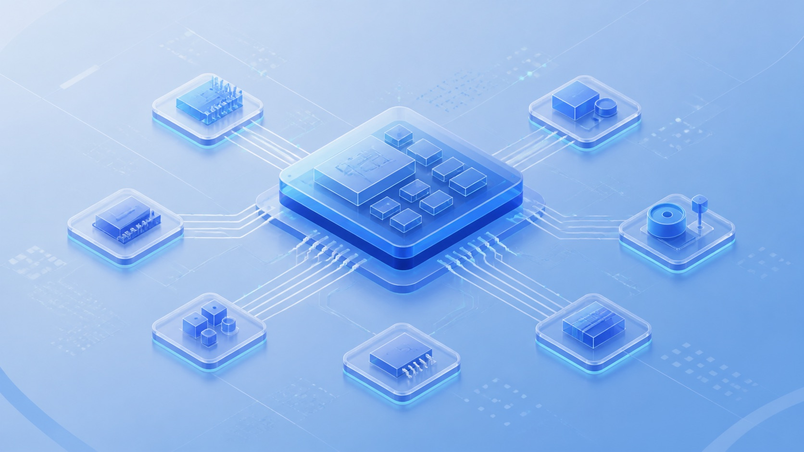
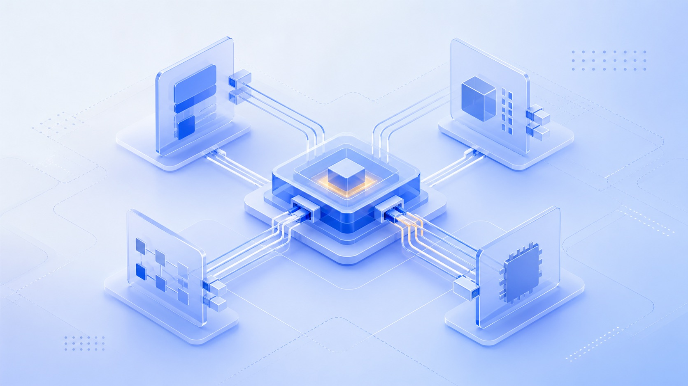
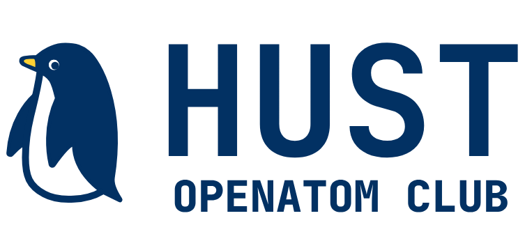
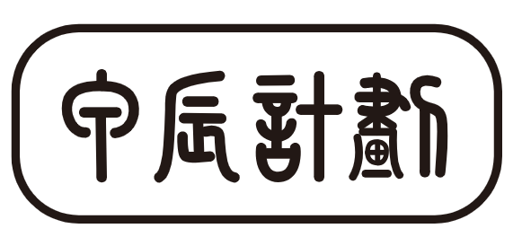
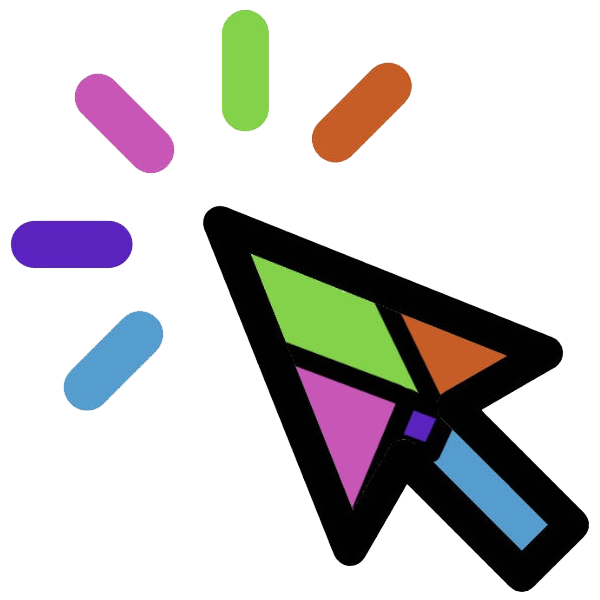
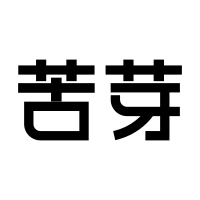
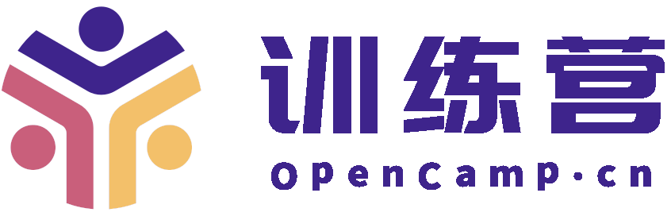
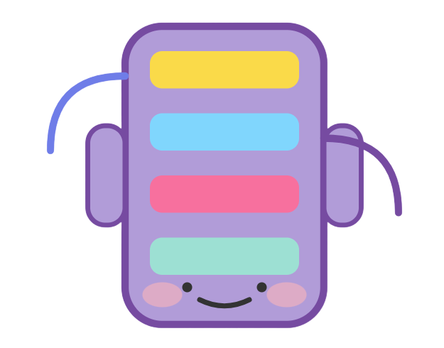
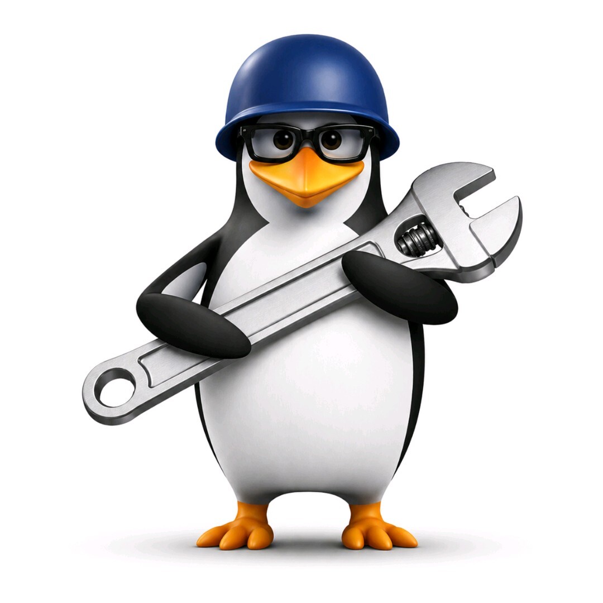

# QEMU Training Camp

  <section class="home-hero">
    
    

      QEMU Training Camp
      
QEMU 训练营

      
以模拟器/虚拟化技术为底座的 CPU/GPGPU 体系结构相关的开放学习与实践平台，全程免费，资料开源，社区共建。

      

        <a class="home-button home-button--primary" href="tutorial/2026/">开始学习</a>
        <a class="home-button" href="exercise/2026/">查看实验</a>
      

    

  </section>

  <section class="home-stat-grid" aria-label="累计训练营数据">
    

      2167
      累计报名人数
    

    

      637
      累计覆盖高校
    

    

      433
      累计覆盖企业
    

    

      140
      累计覆盖城市
    

  </section>

  <section class="home-section">
    

      <h2>学习入口</h2>
      <a href="tutorial/2026/">全部讲义</a>
    

    

      <a class="home-entry-card home-entry-card--wide" href="tutorial/2026/">
        Tutorial
        QEMU 训练营 2026 讲义
        从开发环境、QOM、MemoryRegion 到 TCG、CPU 建模、PCIe、Rust 建模和项目实践。
      </a>
      <a class="home-entry-card" href="exercise/2026/">
        Exercise
        实验手册
        覆盖 C、Rust、CPU、SoC、GPU 等方向的阶段实验。
      </a>
      <a class="home-entry-card" href="blogs/">
        Blog
        技术博客
        训练营成员复盘、建模笔记、软件栈探索和开源协作经验。
      </a>
    

  </section>

  <section class="home-section">
    

      <h2>项目预览</h2>
      <a href="tutorial/2026/ch3/">全部项目</a>
    

    

      <a class="home-product-card" href="tutorial/2026/ch3/qemu-k230/">
        
        K230 星务计算单元建模
        
基于 QEMU 上游 K230 machine，推进 RustSBI 适配、外设补全和安全实验支撑。

      </a>
      <a class="home-product-card" href="tutorial/2026/ch3/qemu-cxlemu/">
        
        CXLMemSim 推理后端优化
        
在 QEMU + CXLMemSim 的 CXL Type-2 仿真环境中优化 Kimi K2.6 供数路径。

      </a>
      <a class="home-product-card" href="tutorial/2026/ch3/qemu-agent/">
        
        Agent 自动化外设建模
        
围绕 STM32 等 MCU 外设，探索参考手册、驱动代码到 QEMU 模型的自动化生成。

      </a>
      <a class="home-product-card" href="tutorial/2026/ch3/qemu-wine-ce/">
        
        Wine-CE 跨架构应用兼容
        
基于 Wine、Box64 与 QEMU user 协作，在 RISC-V 等平台适配 x86 应用和游戏。

      </a>
    

  </section>

  <section class="home-section">
    

      <h2>最新动态</h2>
      <a href="news/2026/qemu-camp-project-stage-2026-07-03/">更多</a>
    

    <a class="home-list-item" href="news/2026/qemu-camp-project-stage-2026-07-03/">
      QEMU 训练营 2026 项目阶段正式开启
      <small>2026.07.03</small>
    </a>
    <a class="home-list-item" href="news/2026/qemu-camp-meetup-2026-04-05/">
      启航！QEMU 训练营 2026 开营，深耕虚拟化与体系结构教学新征程
      <small>2026.04.05</small>
    </a>
    <a class="home-list-item" href="news/2026/qemu-camp-update-2026-03-17/">
      QEMU 训练营 2026 正式开放报名！2000 个名额等你来
      <small>2026.03.17</small>
    </a>
    <a class="home-list-item" href="news/2026/qemu-camp-meetup-2026-02-28/">
      QEMU 训练营 2026 二月工作推进会顺利召开，实验体系初步成型
      <small>2026.02.28</small>
    </a>
    <a class="home-list-item" href="news/2026/qemu-camp-update-2026-01-31/">
      聚焦开源与云原生！GTOC & CNB 首次线下 Meetup 完美收官
      <small>2026.01.31</small>
    </a>
    <a class="home-list-item" href="news/2026/qemu-camp-meetup-2026-01-30/">
      QEMU 训练营 2026 第一次工作推进会顺利召开，各项筹备有序落地
      <small>2026.01.30</small>
    </a>
  </section>

  <section class="home-section">
    

      <h2>社区活动</h2>
      <a href="news/2026/qemu-camp-update-2026-01-31/">查看报道</a>
    

    

      
      
      
    

  </section>

  <section class="home-section" aria-label="合作伙伴">
    

      <h2>合作伙伴</h2>
    

    

      

        
      

      

        
      

      

        
      

      

        
      

      

        
      

      

        
      

      

        
      

      

        
      

      

        
      

      

        
      

    

    
PS: 合作伙伴排名不分先后

  </section>

  <section class="home-section home-about">
    

      <h2>关于 QEMU 训练营</h2>
      
QEMU 训练营是在清华大学陈渝老师团队的倡议下，由格维开源社区发起，并与华中科技大学开放原子俱乐部联合主办的公益性技术训练营，旨在搭建一个以模拟器/虚拟化技术为底座的 CPU/GPGPU 体系结构相关的开放学习与实践平台，全程免费，资料开源，社区共建。

    

    

      发起组织：格维开源社区
      维护团队：QEMU 训练营项目组
      文档许可：CC BY-SA 4.0
      代码许可：MIT
    

  </section>

